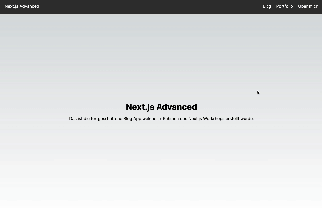

# Next.js Fortgeschritten

## Zielsetzung

Ziel dieser Übung ist es das fortgeschrittene Next.js Wissen aus der Päsentation zu wiederholen und zu vertiefen. Wenn du alle Aufgaben erfolgreich abgeschlossen hast sollte deine Anwendung wie folgt aussehen:



## Aufgaben

1. **Alle Blogposts laden**

- Öffne die Datei `src/app/blog/page.tsx`
- Füge den nötigen Code hinzu um sämtliche Blogposts aus der API zu laden und speichere diese in einer Variablen 'posts'. Verwende für das Laden der Daten folgenden Code:

```ts
await(await fetch(`${process.env.URL}/api`)).json() as Post[];
```

2. **Blogpost anzeigen**

- Rendere direkt unter der Seitenüberschrift 'Blog Posts' die ersten 6 Blogposts. Verwende dazu die bereits im Ordner `src/components` vorhandene Komponente `BlogGrid`. Schaue dir die Komponente vor der Verwendung an, um zu verstehen, wie du alle nötigen Daten an die Komponente übergeben kannst.

3. **Detailseite anzeigen**

- Öffne die Datei `src/app/blog/[postId]/page.tsx`
- Füge den nötigen Code hinzu um den jeweiligen Blogpost aus der API zu laden und speichere diesen in einer Variablen 'post'. Verwende für das Laden der Daten folgenden Code:

```ts
await(await fetch(`${process.env.URL}/api/${postId}`)).json() as Post;
```

- Rendere innerhalb des Containers `<main className={styles.main}>` den Blogpost mit folgendem Inhalt:

```tsx

<h1>{post.title.substring(0, 15)}</h1>
<p>{post.body}</p>
```

## Bonus-Aufgabe: Blogpost ausblenden

1. **Ausblenden Button hinzufügen**

- Öffne die Komponente `src/components/PostCard.tsx`. Diese wird intern von der Komponente `BlogGrid` verwendet um einzelne Blogposts anzuzeigen. Schau dir die Komponente zunächst an, um zu verstehen, was sie aktuell tut.
- Füge einen Button hinzu, der zukünftig das Ausblenden eines Blogposts ermöglichen soll. Verwende dazu folgenden Code:

```tsx
<button className={styles.postRemoveButton} onClick={(e) => handleRemovePost(e, post.id)}>
  X
</button>
```

2. **Ausblenden Funktion hinzufügen**

- Füge der Datei `src/components/PostCard.tsx` die fehlende Funktion `handleRemovePost` hinzu. Diese soll den Blogpost ausblenden, wenn der Button geklickt wird. Verwende dazu folgenden Code als Vorlage:

```ts
function handleRemovePost(e: React.MouseEvent<HTMLButtonElement>, id: number) {
  e.preventDefault();
  // TODO 6: Lade die Liste aller ausgeblendeten Posts aus dem LocalStorage und speicher sie in der Variable hiddenPosts (siehe andere Komponenten dieses Projektes für ein Beispiel)
  if (!hiddenPosts.includes(id)) {
    localStorage.setItem("hiddenPosts", JSON.stringify([...hiddenPosts, id]));
    window.location.reload();
  }
}
```

- Ergänze die fehlende Variable `hiddenPosts` in der Methode handleRemovePost.

3. **Ausblenden Funktion testen**

- Navigiere zu http://localhost:3000/blog
- Klicke auf den Button 'X' eines Blogposts.
- Prüfe ob der Blogpost ausgeblendet wurde.

4. **'Alle Posts einblenden' Button hinzufügen**

- Füge der Datei `src/app/blog/page.tsx` unterhalb der BlogGrid Komponente die folgende Zeile hinzu und importiere die Komponente `ShowAllButton`:

```tsx
<ShowAllButton />
```

- Lade die Seite neu und betrachte den auftretenden Fehler. Was musst du ändern, damit der Fehler verschwindet?
