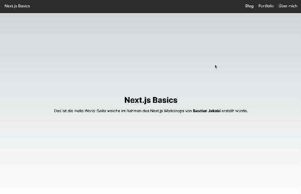

# Next.js Grundlagen - Lösung

## Zielsetzung

Ziel dieser Übung ist es die Next.js Grundlagen aus der Päsentation zu wiederholen und zu vertiefen. Wenn du alle Aufgaben erfolgreich abgeschlossen hast sollte deine Anwendung wie folgt aussehen:



## Aufgaben

1. **Unterseiten erstellen**

- Erstelle in src/app 3 neue Seiten mit den Titeln `about`, `blog` und `portfolio`.

2. **Seiteninhalt hinzufügen**

- Füge jeder Seite folgenden Inhalt hinzu:

  ```tsx
  <main className={styles.main}>
    <h1>[SEITEN_TITEL]</h1>
    <p>Das ist die [SEITEN_TITEL]-Seite.</p>
  </main>
  ```

3. **Seitenfunktion verifizieren**

- Navigiere zu den Seiten `/about`, `/blog` und `/portfolio` und überprüfe, ob der Inhalt korrekt angezeigt wird.

4. **Navigation hinzufügen**

- Öffne die Datei `src/app/layout.tsx` und füge innerhalb von jedem `li` Element in dem Container `<ul className={styles.headerMenu}>` einen Next.js Link hinzu, der auf die entsprechende Seite verweist.

## Bonus-Aufgabe: Dynamische Seiten

1. Erstelle eine dynamische Unterseite, die den Inhalt einer Blog-Post anzeigt. Die URL sollte wie folgt aussehen: `/blog/[POST_ID]`. Die Seite sollte den Titel "Blog Post [POST_ID]" und den Inhalt "Das ist der Inhalt des Blog Posts [POST_ID]." anzeigen.